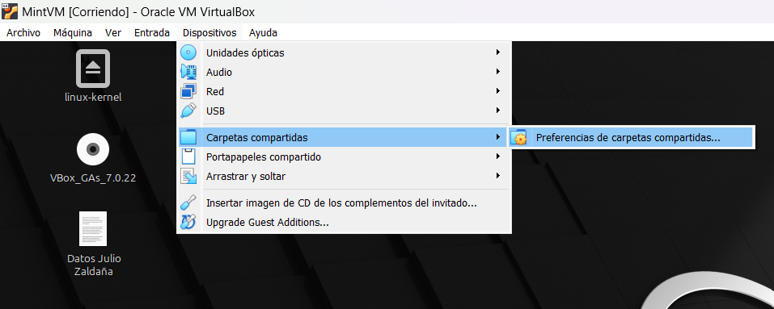

# <div align="center">Proyecto 1</div>
### <div align="center">USAC - Facultad de Ingeniería</div>
### <div align="center">Sistemas Operativos 2 - Sección A</div>
### <div align="center">Vacaciones Segundo Semestre 2024</div>
___

### <div align="center">Nombre: Julio Alejandro Zaldaña Ríos - Carnet: 202110206</div>
*<div align="center">Guatemala 14 de diciembre 2024</div>*

___

### **<div align="center"> Expansión del Kernel de Linux con Nuevas Funcionalidades</div>**

Para la elaboración del proyecto 1 del curso de Sistemas Operativos 2, se realizó la expansión del kernel del sistema operativo Linux Mint 22 Cinnammon Edition. En síntesis, se agregaron nuevas funcionalidades al kernel, elaborando llamadas al sistema, modulos de kernel para comprobar su funcionamiento y realizando un proceso de compilación del kernel, para ajustar todos los cambios realizados.

NOTA:
*Se utilizó Virtual Box para crear una VM para utilizar el sistema operativo de Linux Mint 22*
____

### **<div align="center">Proceso de Primer Compilación del Kernel</div>**

1. Instalar Imagen ISO de Linux Mint: 

Dirigirse a https://www.linuxmint.com/edition.php?id=316, y poder instalar la imagen del sistema operativo para poder montarlo en Virtual Box y poder crear la VM.

2. Crear VM e inicializar Linux Mint:

Configurar todo lo que se nos sea util para utilizar Linux Mint, como copiado bidireccional entre máquina host y la VM, los Guest Additions etc.

3. Instalar Kernel de Linux 6.8 y desempaquetarlo en cualquier directorio por ejemplo en /home.

```bash
wget https://www.kernel.org/pub/linux/kernel/v6.x/linux-6.8.tar.xz

tar -xvf linux-6.8.tar.xz
cd linux-6.8
```
4. Instalar dependencias

```bash
sudo apt-get install build-essential libncurses5-dev fakeroot wget bzip2 openssl
sudo apt-get install build-essential libncurses-dev bison flex libssl-dev libelf-dev
```

A partir de aca, en el directorio del codigo fuente. Se pueden utilizar los permisos del usuario root con "sudo -s"

```bash
sudo -s
```

Copiar el archivo de config por primera vez. (Esto quiere decir que se copia el archivo de configuración por default del kernel de linux 6.8.49, para utilizarlo como base.)

```bash
cp -v /boot/config-$(uname -r) .config
```

Limpiar el ambiente de compilacion

```bash
make clean
```

Modificar la version del kernel en el archivo Makefile que esta en la raiz (siempre dentro de la carpeta del kernel, linux-6.8.)

Hasta arriba, estara asi:

```bash
nano Makefile

# Dentro del archivo Makefile dentro de la carpeta linux-6.8, se encontrarán al principio una serie de parámetros, y se encontrará el siguiente, que se podrá editar, para luego verlo reflejado al momento de compilar el kernel por primera vez.
EXTRAVERSION =

# Cambiarlo a:
EXTRAVERSION = -49-usac1
```

5. Preparación y Pre-Compilación:

Ejecutar los config iniciales:

```bash
make oldconfig
```
Darle enter a todo

```bash
make localmodconfig
```

6. Luego se debería de deshabilitar los certificados de firma oficiales de Cannonical, para que no se interrumpa el proceso de compilación.

```bash
scripts/config --disable SYSTEM_TRUSTED_KEYS
scripts/config --disable SYSTEM_REVOCATION_KEYS
```

7. Primera Compilación del Kernel

Se compila con el siguiente comando.
NOTA: Tomar en cuenta que nproc, es la cantidad de núcleos en la VM. En este caso para esta ocasión por la cantidad de recursos de mi computadora, se han asignado 5 núcleos para la VM con 3 GB RAM.

El --ignore; significa que se reservará 1 núcleo de la VM, en este caso, para que no se relentice por completo la interfaz del sistema.

```bash
make -j$(nproc --ignore=1)
```

8. Post-Compilación del Kernel

Se instalan ciertos elementos de forma posterior al proceso de compilación.

```bash
make modules_install
make install
make headers_install
update-grub2
```

A partir de ahora si se siguieron todos los pasos de la forma anterior, debería de aparacer el nuevo kernel y convertirse en el nuevo kernel por default al iniciar.

Si no sale en la lista de kernels al iniciar, se puede intentar colocar el siguiente comando, para actualizarlo:

sudo update-grub2


Sino a la hora de encender la VM, cuando salga el logo de VirtualBox, mantener presionado shift, para que abra el GRUB de Linux Mint, para luego abrir todas las Advanced Features de Linux Mint, para poder seleccionar el kernel que se requiera trabajar.

___

### **<div align="center">Código fuente del kernel modificado</div>**

#### Personalización del nombre del sistema:

Realizar un cambio en el archivo uts.h en la carpeta /include/linux del kernel, en la variable **UTS_SYSNAME**.

```
UTS_SYSNAME = Linux Julz SopesOS
```
**Comprobación:**

```bash
uname -s
```


#### Mensajes de inicio personalizados: 

Realizar un cambio en el archivo main.c en la carpeta init; en la función **start_kernel**.

```bash
dmesg
```


Realizar compilación, para visualizar cambios en el kernel. (Se puede utilizar el script para compilación **compile_and_install.sh**)

___


### **<div align="center">Carpeta Compartida</div>**

Se han utilizado las carpetas compartidas en Virtual Box, para poder tener un manejo del codigo y poder mostrar los cambios.




___

### **<div align="center">Llamadas al Sistema</div>**


#### Syscall 1: capture_memory_snapshot

Esta llamada al sistema se centra en; 

#### Syscall 2: track_syscall_usage

Donde encontrar los syscalls:

1. Read: En el archivo read_write.c en SYSCALL_DEFINE3(read,...) (627)
2. Write: En el archivo read_write.c en SYSCALL_DEFINE3(write,...) (652)
3. Open: La syscall open se define en el archivo fs/open.c como ksys_open
4. Fork: La syscall fork está definida en el archivo kernel/fork.c.

#### Syscall 3: get_io_throttle


___

### **<div align="center">Módulos de Kernel (Pruebas realizadas)</div>**


___ 

### **<div align="center">Reflexión Personal</div>**


___

### **<div align="center">Errores Comunes</div>**

ld: arch/x86/entry/syscall_64.o:(.rodata+0x1148): undefined reference to `__x64_sys_julioz_get_io_throttle'


___

### **<div align="center">E-grafía</div>**


* https://elixir.bootlin.com/linux/v6.8/source/kernel/sys.c
* https://elixir.bootlin.com/linux/v6.8/source/include/linux/vmstat.h#L200
