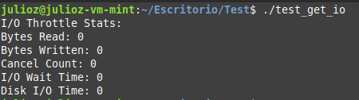

# <div align="center">Proyecto 1</div>
### <div align="center">USAC - Facultad de Ingeniería</div>
### <div align="center">Sistemas Operativos 2 - Sección A</div>
### <div align="center">Vacaciones Segundo Semestre 2024</div>
___

### <div align="center">Nombre: Julio Alejandro Zaldaña Ríos - Carnet: 202110206</div>
*<div align="center">Guatemala 14 de diciembre 2024</div>*

___

### **<div align="center"> Expansión del Kernel de Linux con Nuevas Funcionalidades</div>**

Para la elaboración del proyecto 1 del curso de Sistemas Operativos 2, se realizó la expansión del kernel del sistema operativo Linux Mint 22 Cinnammon Edition. En síntesis, se agregaron nuevas funcionalidades al kernel, elaborando llamadas al sistema, modulos de kernel para comprobar su funcionamiento y realizando un proceso de compilación del kernel, para ajustar todos los cambios realizados.

NOTA:
*Se utilizó Virtual Box para crear una VM para utilizar el sistema operativo de Linux Mint 22*
____

### **<div align="center">Proceso de Primer Compilación del Kernel</div>**

1. Instalar Imagen ISO de Linux Mint: 

Dirigirse a https://www.linuxmint.com/edition.php?id=316, y poder instalar la imagen del sistema operativo para poder montarlo en Virtual Box y poder crear la VM.

2. Crear VM e inicializar Linux Mint:

Configurar todo lo que se nos sea util para utilizar Linux Mint, como copiado bidireccional entre máquina host y la VM, los Guest Additions etc.

3. Instalar Kernel de Linux 6.8 y desempaquetarlo en cualquier directorio por ejemplo en /home.

```bash
wget https://www.kernel.org/pub/linux/kernel/v6.x/linux-6.8.tar.xz

tar -xvf linux-6.8.tar.xz
cd linux-6.8
```
4. Instalar dependencias

```bash
sudo apt-get install build-essential libncurses5-dev fakeroot wget bzip2 openssl
sudo apt-get install build-essential libncurses-dev bison flex libssl-dev libelf-dev
```

A partir de aca, en el directorio del codigo fuente. Se pueden utilizar los permisos del usuario root con "sudo -s"

```bash
sudo -s
```

Copiar el archivo de config por primera vez. (Esto quiere decir que se copia el archivo de configuración por default del kernel de linux 6.8.49, para utilizarlo como base.)

```bash
cp -v /boot/config-$(uname -r) .config
```

Limpiar el ambiente de compilacion

```bash
make clean
```

Modificar la version del kernel en el archivo Makefile que esta en la raiz (siempre dentro de la carpeta del kernel, linux-6.8.)

Hasta arriba, estara asi:

```bash
nano Makefile

# Dentro del archivo Makefile dentro de la carpeta linux-6.8, se encontrarán al principio una serie de parámetros, y se encontrará el siguiente, que se podrá editar, para luego verlo reflejado al momento de compilar el kernel por primera vez.
EXTRAVERSION =

# Cambiarlo a:
EXTRAVERSION = -49-usac1
```

5. Preparación y Pre-Compilación:

Ejecutar los config iniciales:

```bash
make oldconfig
```
Darle enter a todo

```bash
make localmodconfig
```

6. Luego se debería de deshabilitar los certificados de firma oficiales de Cannonical, para que no se interrumpa el proceso de compilación.

```bash
scripts/config --disable SYSTEM_TRUSTED_KEYS
scripts/config --disable SYSTEM_REVOCATION_KEYS
```

7. Primera Compilación del Kernel

Se compila con el siguiente comando.
NOTA: Tomar en cuenta que nproc, es la cantidad de núcleos en la VM. En este caso para esta ocasión por la cantidad de recursos de mi computadora, se han asignado 5 núcleos para la VM con 3 GB RAM.

El --ignore; significa que se reservará 1 núcleo de la VM, en este caso, para que no se relentice por completo la interfaz del sistema.

```bash
make -j$(nproc --ignore=1)
```

8. Post-Compilación del Kernel

Se instalan ciertos elementos de forma posterior al proceso de compilación.

```bash
make modules_install
make install
make headers_install
update-grub2
```

A partir de ahora si se siguieron todos los pasos de la forma anterior, debería de aparacer el nuevo kernel y convertirse en el nuevo kernel por default al iniciar.

Si no sale en la lista de kernels al iniciar, se puede intentar colocar el siguiente comando, para actualizarlo:

sudo update-grub2


Sino a la hora de encender la VM, cuando salga el logo de VirtualBox, mantener presionado shift, para que abra el GRUB de Linux Mint, para luego abrir todas las Advanced Features de Linux Mint, para poder seleccionar el kernel que se requiera trabajar.

___

### **<div align="center">Código fuente del kernel modificado</div>**

#### Personalización del nombre del sistema:

Realizar un cambio en el archivo uts.h en la carpeta /include/linux del kernel, en la variable **UTS_SYSNAME**.

```
UTS_SYSNAME = Linux Julz SopesOS
```
**Comprobación:**

```bash
uname -s
```


#### Mensajes de inicio personalizados: 

Realizar un cambio en el archivo main.c en la carpeta init; en la función **start_kernel**.

```bash
dmesg
```


Realizar compilación, para visualizar cambios en el kernel. (Se puede utilizar el script para compilación **compile_and_install.sh**)

___


### **<div align="center">Carpeta Compartida</div>**

Se han utilizado las carpetas compartidas en Virtual Box, para poder tener un manejo del codigo y poder mostrar los cambios entre VM y maquina host.


___

### **<div align="center">Llamadas al Sistema</div>**


#### Syscall 1: capture_memory_snapshot

Esta llamada al sistema se centra en poder capturar en un instante todas las estadísticas más relevantes relacionados con la memoria del sistema. Esto permitirá al usuario poder visualizar con detalle algunas estadísticas que reflejan el estado de la memoria actual en términos de KB.

Se toma como base el struct de sysinfo, que tiene varios atributos, que son de utilidad para reutilizar en la llamada.

##### Implementación

- Se definió como *SYSCALL 551*, en la tabla de syscalls (syscall_64.tbl)
- Se realizó la implementación dentro del archivo kernel/sys.c
    - Se creo un struct: **mem_snapshot** ; para poder recopilar la información de la llamada.

- Se utiliza el desplazamienot de pagina, PAGE_SHIFT es 12, así que PAGE_SHIFT - 10 es igual a 2. Que ayuda a convertir la cantidad de memoria de páginas a unidades más grandes, en este caso se mostrará en KB.
- Se añadio asmlinkage en include/linux/syscall.h

Se utilizaron algunas constantes que indican los índices de los diferentes tipos de tiempos de CPU dentro de la matriz *cpustat*.

-  NR_ACTIVE_ANON:  "Anónimo" significa que no están asociadas con ningún archivo y típicamente incluyen memoria asignada dinámicamente y pilas.

- NR_ACTIVE_FILE: Páginas de Archivo Activas: Estas son las páginas de memoria que están activamente en uso y están respaldadas por archivos en disco. 

- NR_FILE_PAGES: Páginas de Archivos - son las páginas de memoria que están respaldadas por archivos en el disco. 

- Se hace uso de la función **global_node_page_state**: La función global_node_page_state se utiliza para obtener el estado global de varias estadísticas de páginas en el sistema. 


##### Prueba

- Se creó un archivo en C y se compiló, para poder verificar si se puede acceder a la llamada desde el espacio de usuario.


#### Syscall 2: track_syscall_usage

Esta llamada al sistema se centra en poder detectar las funciones base read, write, open y fork, que al momento de que se ejecuten en el sistema, se inicializará un contador, que luego será de utilidad para mostrar la cantidad de veces que esas mismas funciones fueron llamadas por el usuario.

Donde encontrar los syscalls:

1. Read: En el archivo read_write.c en SYSCALL_DEFINE3(read,...) (627)
2. Write: En el archivo read_write.c en SYSCALL_DEFINE3(write,...) (652)
3. Open: La syscall open se define en el archivo fs/open.c como ksys_open
4. Fork: La syscall fork está definida en el archivo kernel/fork.c.
5. Clone: La syscall clone está definida en kernel/fork.c.

##### Implementación

- Se definió como *SYSCALL 552*, en la tabla de syscalls (syscall_64.tbl)
- Se realizó la implementación dentro del archivo kernel/usac/syscall2.h
    - Se creo un struct: **syscall_usage** ; para poder recopilar la información de la llamada.
    - Se utilizó la función **track_syscall()** para poder interceptar y poder agregar como un contador, de syscalls. Se añadió esta función independiente en cada syscall que se requería trackear.
- Se añadio header en usac/include/syscall2.h

##### Prueba

- Se creó un archivo en C y se compiló, para poder verificar si se puede acceder a la llamada desde el espacio de usuario.


##### Prueba

- Se creó un archivo en C y se compiló, para poder verificar si se puede acceder a la llamada desde el espacio de usuario.

#### Syscall 3: get_io_throttle

Esta llamada al sistema se centra en poder obtener las estadísticas base de entrada y salida de los procesos del sistema. Se utiliza como base el struct task, para desglosar y trabajar con sus estadísticas de entrada y salida.

##### Implementación

- Se definió como *SYSCALL 553*, en la tabla de syscalls (syscall_64.tbl)
- Se realizó la implementación dentro del archivo kernel/usac/syscall3.h
    - Se creo un struct: **io_stats** ; para poder recopilar la información de la llamada.
- Se añadio header en usac/include/syscall3.h


##### Prueba

- Se creó un archivo en C y se compiló, para poder verificar si se puede acceder a la llamada desde el espacio de usuario.



*NOTA: Se puede utilizar el siguiente comando, para verificar todas las llamadas creadas después de la compilación del kernel (con script compile_and_install.sh)*

```bash
cat /proc/kallsyms | grep sys_julioz_
```
___

### **<div align="center">Módulos de Kernel (Pruebas realizadas)</div>**

Los modulos de kernel son programas que son utiles para poder extender el kernel. Para el proyecto han sido de gran utilidad para poder extender las funcionalidades y mandar a llamar a las syscalls creadas en el espacio del kernel, para luego poder visualizar las estadísticas dentro del espacio del usuario, donde se podrá visualizar dentro de la carpeta /proc.

**Comandos a utilizar**

Para la generación de archivos y compilación del archivo C.
```bash
make
```
Se instala/carga el módulo
```bash
sudo insmod mem_and_cpu_info_202110206.ko
```
Ver log de kernel, con mensaje de que se cargó el módulo
```bash
sudo dmesg | tail -n 5
```
Verificar si está activo el módulo
```bash
lsmod | grep mem_and_cpu_info_202110206
```
Ver archivo creado en /proc, y verificar su información.
```bash
cat /proc/mem_and_cpu_info_202110206
```


1. **Modulo Extra:**

Se desarrolló un pequeño modulo de kernel, para poder obtener las estadísticas de memoria del sistema, al igual que un calculo para presentar el porcentaje de uso de CPU, utilizando los jiffies. 

Los jiffies son un término en el contexto del kernel de Linux que se refiere a una unidad de tiempo. 

Se utiliza también la estructura **kcpustat**, que contiene estadísticas de tiempo de CPU.


___ 

## **<div align="center">Habilidades Blandas</div>**

Se ha realizado una pequeña planificación de acuerdo el tiempo del proyecto, y se han añadido algunas notas sobre la experiencia al momento de desarrollar el proyecto.

### **<div align="center">Autogestión del Tiempo</div>**

| Fecha | Actividad  |
| - | - |
| 5-6 de diciembre | Primera Compilacion Kernel |
| 11 de diciembre | Configuracion Basica de Kernel |
| 12 de diciembre | Creación de 1er syscall y prueba |
| 13 de diciembre | Creación de 2da syscall |
| 14 de diciembre | Prueba de 2da syscall, modulo extra y creación 3era syscall |

### **<div align="center">Responsabilidad y Compromiso</div>**

Se ha tomando en cuenta que manejar el kernel de un sistema operativo es una tarea bastante minuciosa, y requiere mucho tiempo y cuidado, para poder investigar sobre el funcionamiento adecuado, para que al momento de configurar o editar archivos del kernel, no existan problemas posteriores. 

Es por eso que se considera muy importante, ir almacenando las versiones anteriores de los archivos editados, por si alguna problemática existe, al momento de recompilar o iniciar el sistema.

### **<div align="center">Errores Comunes y Soluciones</div>**

Se han obtenido algunos errores comunes como: 

```bash
ld: arch/x86/entry/syscall_64.o:(.rodata+0x1148): undefined reference to `__x64_sys_julioz_get_io_throttle'
```

La mayoría de problemas persistieron durante la recompilación del kernel, al momento de definir las llamadas. Y la mayoría de veces fue por problemas de que faltó importar los headers de las llamadas, digamos los archivos .h. No se indicaron bien en los archivos de implementación, o bien faltó colocar que se incluyeran dentro de los Makefiles, que se encuentran en las carpetas de kernel y kernel/usac. Entonces hizo falta insertar esas definiciones para poder compilarlos sin ningun problema.


### **<div align="center">Reflexión Personal</div>**

En general el proyecto es muy interesante, ya que se puede entrar muy a fondo en lo que es un sistema operativo, en este caso Linux, y visualizar en realidad como la mayoría  de funciones son definidas dentro del espacio de kernel, y como se realiza esa conexión con el espacio de usuario para que pueda utilizar esas funciones y llamadas al sistema creadas desde el espacio de kernel y así los funcionamientos en el sistema sean funcionales.

El tiempo es un factor importante y aprovecharlo es de vital importancia, para poder llegar a investigar, implementar funcionalidades, y realizar pruebas en el sistema operativo.


___

### **<div align="center">E-grafía</div>**


* https://elixir.bootlin.com/linux/v6.8/source/kernel/sys.c
* https://elixir.bootlin.com/linux/v6.8/source/include/linux/vmstat.h#L200
* https://www.geeksforgeeks.org/input-output-system-calls-c-create-open-close-read-write/
* https://www.geeksforgeeks.org/fork-system-call/
* https://elixir.bootlin.com/linux/v6.8/source/include/linux/kernel_stat.h#L53
