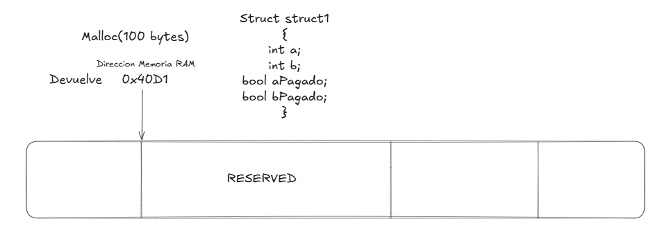
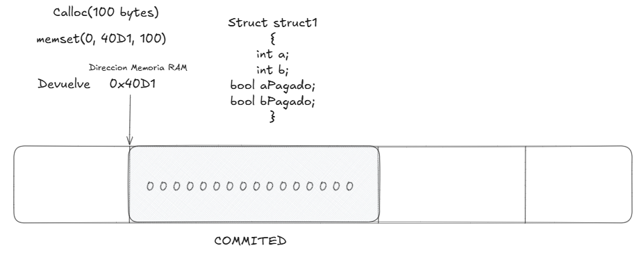
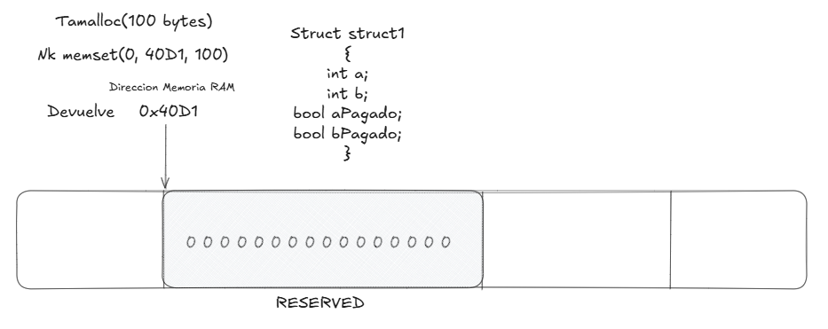
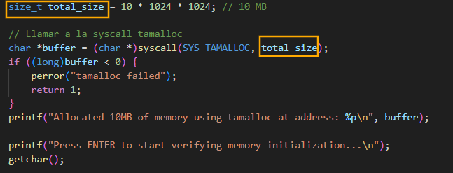
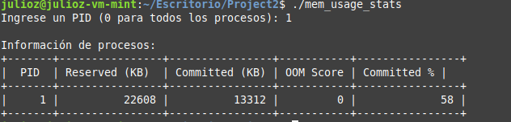
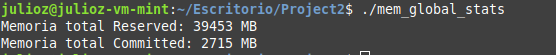

# <div align="center">Proyecto 2</div>
### <div align="center">USAC - Facultad de Ingeniería</div>
### <div align="center">Sistemas Operativos 2 - Sección A</div>
### <div align="center">Vacaciones Segundo Semestre 2024</div>
___

### <div align="center">Nombre: Julio Alejandro Zaldaña Ríos - Carnet: 202110206</div>
*<div align="center">Guatemala 26 de diciembre 2024</div>*

___

### **<div align="center"> Asignador de memoria con lazy-zeroing en Linux </div>**

Para el Proyecto 2 del Curso de Sistemas Operativos, se realiza la implementación de un asignador de memoria el cual asegure la inicialización de memoria en 0 sin marcar toda su memoria como utilizada
inmediatamente. Se ha construido una variante con el nombre de **tamalloc.** 

Para comprender un poco sobre la implementación del funcionamiento de tamalloc; se deberá entender algunos conceptos y principios de asignación de memoria.


* **malloc:**
Devuelve un puntero. Marca la memoria como Reservada.

void *ptr = malloc (n * size_of_elements);
memset(ptr, 0 , n * size_of_elements);



* **calloc**
Hace uso de memset, la memoria que se pide, se marcan en 0.
Ya no es reservada sino que es memoria commited.



* **tamalloc**
Tiene que quedar en reserved, pero si inicializado en 0.




* **Vmsize:** Devuelve cuanta memoria ha sido alocada (reservada solicitada) por un proceso.

* **VmRSS:** Nos brinda la cantidad de memoria que reside en RAM, de la cual esta siendo activamente usada.

* **oom_score** Es un valor que se asigna a cada proceso que está en ejecución en Linux y que indica la probabilidad de que sea eliminado si el sistema tiene poca memoria

**Lazy-zeroing:**

Técnica utilizada por los gestores de memoria para mejorar la eficiencia en la asignación de memoria. En lugar de inicializar (rellenar con ceros) toda la memoria asignada de inmediato, lazy-zeroing pospone esta inicialización hasta que la memoria realmente se utilice.

#### Comparación alojadores de memoria:
 
| | malloc | calloc | tamalloc |
| - | - | - | - |
| init en 0 |  ❌ | ✔  | ✔ |
| VmSize Inmediato |  ✔ | ✔ | ✔ |  
| VmRSS No Inmediato | ✔   | ❌  | ✔ |


___

### **<div align="center"> Desarrollo de Tamalloc </div>**

En general cualquier proceso utiliza malloc, para poder asignar memoria. Pero una de las desventajas de malloc, es que no se inicializa el bloque de memoria asignado en 0, es por ello que se ha realizado la creación de un nuevo alojador llamado *tamalloc*, que cumple con casi el mismo funcionamiento de malloc.

#### Objetivos

El alojador de memoria Tamalloc tendrá como objetivo:

1. Toma como argumento la cantidad de memoria a alojar
2. Devolver un puntero como cualquier otro alojador. (Dirección Virtual)
3. Inicializa en el espacio 0.
4. No marcar la memoria como utilizada (relacionado al OOM)

#### Funcionamiento

1. **Entrada:** Como argumento se ingresa el tamaño de memoria a reservar. En donde el usuario especifica el tamaño en bytes a reservar (size).

Si el tamaño es 0, se devuelve el error -EINVAL indicando una entrada inválida.

2. **Alineación del tamaño:** El tamaño solicitado se alinea al tamaño de página más cercano utilizando **PAGE_ALIGN(size)**.

Esto asegura que la memoria solicitada esté alineada con las páginas de memoria del sistema, lo cual es esencial para una correcta gestión de memoria.

3. **Mapping de memoria virtual:** Se utiliza la función interna del kernel **vm_mmap** para mapear un espacio de memoria virtual. 

Los parámetros clave son:

- NULL: Indica que el sistema puede elegir cualquier dirección virtual disponible.
- 0: Offset inicial (para mapeos anónimos, no se utiliza).
- aligned_size: Tamaño alineado a reservar.
- PROT_READ | PROT_WRITE: Permisos de lectura y escritura en la memoria reservada.
- MAP_PRIVATE | MAP_ANONYMOUS | MAP_NORESERVE: 
**Banderas a utilizar para mapeo:**
    - MAP_PRIVATE: La memoria reservada es privada al proceso que la solicita. Si se copia, se usa copy-on-write (COW).
    - MAP_ANONYMOUS: La memoria no está asociada a un archivo físico y se inicializa automáticamente en 0.
    - MAP_NORESERVE: No reserva espacio de swap ni memoria física inmediatamente, optimizando recursos.


___

### **<div align="center"> Creación de Syscalls </div>**

La creación de syscalls ha sido de vital importancia, ya que para el manejo de los funcionamientos en el espacio de usuario, ha sido mucho más fácil implementando dichas llamadas.

#### Syscall 1: **tamalloc** (Función para asignación de memoria)

Se ha construido y realizado la implementación de una llamada al sistema exclusivamente para el funcionamienot del alojador de memoria "tamalloc", con el objetivo de poder replicar y combinar los funcionamientos más relevantes de los alojadores de memoria más utilizados como lo son calloc y malloc.

Para la implementación, se requirió tener bien en cuenta todos los requisitos previos a utilizar en la función de Tamalloc. Como sería la inicialización de memoria en 0, al momento de la asignación de memoria. O por otro lado, retornar una dirección de memoria virtual (como puntero).

* Se ha hecho uso de la función **vm_mmap**, para poder realizar la inicialización en 0 de los bloques de memoria.
* Se definió como *SYSCALL 554*, en la tabla de syscalls (syscall_64.tbl)
* Se realizó la implementación dentro del archivo kernel/usac/tamalloc.c

##### Uso de Tamalloc en Espacio de Usuario



##### Prueba

Utilizando un archivo de prueba

#### Syscall 2: **get_memory_usage_stats** (Consulta de estadísticas de memoria de procesos)

Se ha construido esta syscall con el objetivo, de poder consultar las estadísticas más relevantes, relacionadas a la asignación de memoria, para poder tener una visualización más cercana sobre el comportamiento y el cambio en las estadísticas al usar el alojador de memoria *tamalloc*. 

* Se definió como *SYSCALL 555*, en la tabla de syscalls (syscall_64.tbl)
* Se realizó la implementación dentro del archivo kernel/usac/pidstats.c

Para la implementación, se requirió la utilización:

* **task_struct**: struct importante para poder obtener las estadísticas de vm_size y vm_rss. 
* **for_each_process(task)**: función útil para poder recorrer como un ciclo por los procesos del sistema
* **find_task_by_vpid(pid)**: función útil para poder encontrar un task o proceso en específico dado por parámetro
* **oom_badness()/oom_score_adj**: función utilizada para retornar y ajustar el puntaje de OOM.

#### Syscall 3: **get_global_memory_usage_stats** (Consulta de estadísticas de memoria globales)

Se ha construido esta syscall con el objetivo, de poder consultar y mostrar las estadísticas de memoria reservada y memoria utilizada por el sistema en GENERAL o GLOBAL, contabilizando todos los procesos.

* Se definió como *SYSCALL 556*, en la tabla de syscalls (syscall_64.tbl)
* Se realizó la implementación dentro del archivo kernel/usac/globalstats.c

Para la implementación, se requirió la utilización:

* **task_struct**: struct importante para poder obtener las estadísticas de vm_size y vm_rss. 
* Se realizó una suma de las stats respectivas, para poder presentar las estadísticas globales.


*NOTA: Se puede utilizar el siguiente comando, para verificar todas las llamadas creadas después de la compilación del kernel (con script compile_and_install.sh)*

```bash
cat /proc/kallsyms | grep sys_julioz_
```
___

### **<div align="center"> Pruebas y Estadísticas </div>**


Para probar la asignación de memoria de tamalloc, se puede verificar el archivo de prueba, y al mismo tiempo ejecutar el siguiente comando; que ayudará a visualizar especificamente dos atributos muy importantes al momento de manejar y alocar memoria; que sería el VMRSS y el VMSize.

```bash
watch -n 0.5 "cat /proc/2903/status | grep -E 'VmRSS|VmSize'"
```

Por otro lado, para verificar el comportamiento de los procesos manipulados con el alojador *tamalloc*, se han creado dos syscalls para obtener las estadísticas de memoria de procesos.

**julioz_get_memory_usage_stats**

1) Reserved Memory (VM Size) (kb)
2) Commited Memory (VM RSS) (kb)
3) OOM Score
4) Porcentaje Commited Memory 

Ejemplo:

- Obtención de lista de procesos (Presionando PID = 0)

<center>

</center>

- Obtención de proceso único (Ej: Presionando PID = 1)




**julioz_get_global_memory_usage_stats**

1) Reserved Memory Total Sistema (MB)
2) Commited Memory Total Sistema (MB)

Ejemplo:

Obtención de estadísticas globales del sistema



#### **Verificación**

Para verificar que el funcionamiento del alojador *tamalloc* es el correcto; se tienen que cumplir que las estadísticas cumplan con el siguiente comportamiento:

* *VM Size:* Después de inicializarse *tamalloc* sube drásticamente, dependiendo de la cantidad de memoria ingresada como argumento en la función tammalloc. (Por ejemplo que se asigne 10 MB, subirá 10 MB) inicializandose en 0 (ocupando 0s en el espacio de memoria asignado)
* *VM RSS:* Después de haberse asignado el bloque de memoria, tendrá que ir llenando memoria, de a poco, subiendo la estadística lentamente.

___ 

## **<div align="center">Habilidades Blandas</div>**

Se ha realizado una pequeña planificación de acuerdo el tiempo del proyecto, y se han añadido algunas notas sobre la experiencia al momento de desarrollar el proyecto.

### **<div align="center">Autogestión del Tiempo</div>**

| Fecha | Actividad  |
| - | - |
| 21 de diciembre | Investigación conceptos de Asignación de Memoria|
| 22 de diciembre | Se comienza implementación Tamalloc |
| 23 de diciembre | Se continúa implementación Tamalloc y prueba |
| 25 de diciembre | Creación y prueba de 2da syscall y Creación 3era syscall  |
| 26 de diciembre | Prueba de 3era syscall y validaciones |

### **<div align="center">Responsabilidad y Compromiso</div>**

Se debe de tomar en cuenta que para la correcta elaboración del proyecto,se necesita un tiempo considerable para investigar sobre los structs y funcionamientos generales de las herramientas a utilizar en el proyecto, al igual para poder ubicar, implementar y realizar pruebas respectivas de las funcionalidades solicitadas.

Se necesita un gran compromiso, para poder implementar, recompilar el kernel constantemente para hacer pruebas, verificar funcionalidades etc.

### **<div align="center">Errores Comunes y Soluciones</div>**

Al compilar el código de la SYSCALL TAMALLOC, me ha salido el siguiente error:

```bash
kernel/usac/tamalloc.c: In function ‘__do_sys_julioz_tamalloc’:
kernel/usac/tamalloc.c:23:12: error: too few arguments to function ‘do_mmap’
   23 |     addr = do_mmap(NULL, 0, aligned_size, PROT_READ | PROT_WRITE, MAP_PRIVATE | MAP_ANONYMOUS | MAP_NORESERVE, 0);
      |            ^~~~~~~
In file included from ./include/linux/ring_buffer.h:5,
                 from ./include/linux/trace_events.h:6,
                 from ./include/trace/syscall.h:7,
                 from ./include/linux/syscalls.h:93,
                 from kernel/usac/tamalloc.c:2:
./include/linux/mm.h:3371:22: note: declared here
 3371 | extern unsigned long do_mmap(struct file *file, unsigned long addr,
```

**Causa:**

La función do_mmap requiere más argumentos de los que se han proporcionado. Sin embargo, después de verificar y realizar pruebas, se llegó a la conclusión que no se debería usar directamente do_mmap en una syscall, porque es una función interna del kernel. 


**Solución:**

Se provee la solución de utilizar en vez de do_mmap, utilizar la función **vm_mmap**, que es una capa de abstracción más sencilla para mapear memoria en syscalls. 

```c
unsigned long vm_mmap(struct file *file, unsigned long addr,
                      unsigned long len, unsigned long prot,
                      unsigned long flags, unsigned long pgoff);
```                  


### **<div align="center">Reflexión Personal</div>**

En general el segundo proyecto del laboratorio del curso, es muy interesante y constructivo; ya que se puede experimentar bastante en la temática de asignación de memoria de un sistema operativo, en este caso Linux. En este caso estudiar más a fondo el comportamiento de muchas funciones que alojan memoria como lo son calloc, malloc etc, poder implementar una variante, es de gran utilidad, ya que brinda una gran perspectiva de como funciona la repartición de memoria a los procesos de un sistema operativo. De igual manera, poder utilizar de estadísticas del sistema implementando syscalls para verificar el comportamiento del alojador creado *tamalloc*. 

El tiempo ha sido un factor importante y aprovecharlo es de vital importancia, para poder llegar a investigar, implementar funcionalidades, y realizar pruebas en el sistema operativo.

___

### **<div align="center"> E-grafía </div>**

- https://www.geeksforgeeks.org/dynamic-memory-allocation-in-c-using-malloc-calloc-free-and-realloc/
- https://stackoverflow.com/questions/7582301/virtual-memory-size-on-linux
- https://learn.redhat.com/t5/RH442-Red-Hat-Performance-Tuning/Linux-virtual-memory-manager/td-p/42926
- https://neo4j.com/developer/kb/linux-out-of-memory-killer/


