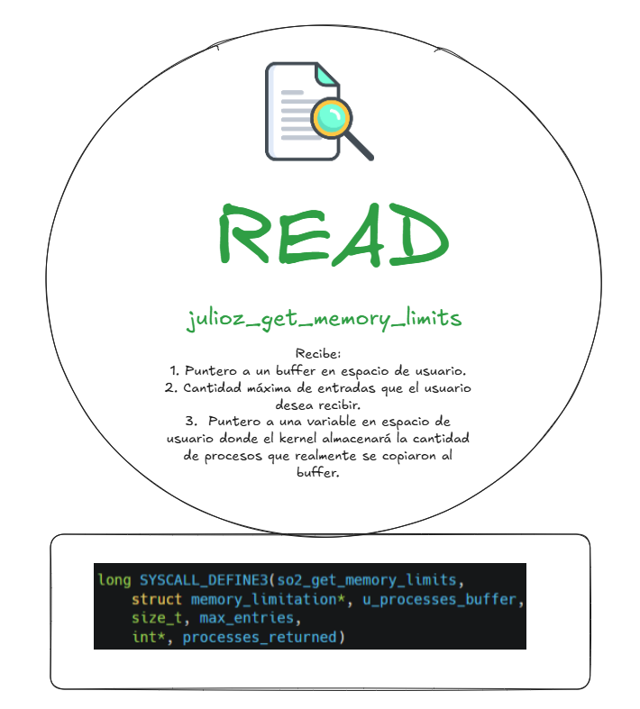

# <div align="center">Proyecto 3</div>
### <div align="center">USAC - Facultad de Ingeniería</div>
### <div align="center">Sistemas Operativos 2 - Sección A</div>
### <div align="center">Vacaciones Segundo Semestre 2024</div>
___

### <div align="center">Nombre: Julio Alejandro Zaldaña Ríos - Carnet: 202110206</div>
*<div align="center">Guatemala 2 de enero 2025</div>*

___

### **<div align="center"> Limitador de memoria para procesos en Linux </div>**

Para el Proyecto 3 del Curso de Sistemas Operativos, se realiza la implementación de un limitador de memoria para procesos, el cual asegura limitar los recursos de la computadora y mantenerlos bajos.
Es así que se ha planteado implementar un sistema de memoria que guarde los registros de los procesos que están limitados en una lista dinámica. El sistema consiste en la creación de una lista enlazada, la cual ayudará a realizar el control, que va a a monitorear que procesos deben ser limitados y cual es el valor máximo de memoria para cada uno de ellos. 

___

### **<div align="center"> Lista Enlazada </div>**


Se ha utilizado una lista enlazada dinámica que guardará el PID del proceso y la cantidad de memoria maxima que el proceso tiene que ser capaz de pedir.

Se ha hecho uso una macro base de Linux, para utilizar una lista enlazada. Obtenido de "<linux/list.h>".

<p align="center">

</p>

**Nodo:**

El nodo o elemento que compondrá la lista enlazada se basa en el siguiente struct:

<p align="center">

</p>

**Uso de Mutex**

También se hace uso de algunas funciones de mutex:

<p align="center">

</p>


___

### **<div align="center"> Creación de Syscalls </div>**

La creación de syscalls ha sido de vital importancia, ya que consiste en los funcionamientos más importantes de la lista manejadora de memoria de procesos.

Las syscalls se basan en el funcionamiento como si fuese un CRUD. 

C: Create - *Syscall 1: julioz_add_memory_limit*
R: Read - *Syscall 2: julioz_get_memory_limits*
U: Update - *Syscall 3: julioz_update_memory_limit*
D: Delete - *Syscall 4: julioz_remove_memory_limit*

#### Syscall 1: **julioz_add_memory_limit** (Limitación de un proceso)

<p align="center">

</p>


* Solo para sudo
* Agregar procesos a una lista.
* SYSCALL 557

#### Syscall 2: **julioz_get_memory_limits** (Obtención de una lista de procesos limitados)

<p align="center">

</p>


* Para cualquier usuario
* Obtiene y entrega todos los procesos de la lista.
* SYSCALL 558

#### Syscall 3: **julioz_update_memory_limit** (Actualización del límite de un proceso)

<p align="center">

</p>


* Solo para sudo
* Actualiza la información de los procesos en la lista.
* SYSCALL 559

#### Syscall 4: **julioz_remove_memory_limit** (Remover el límite de un proceso)

<p align="center">

</p>


* Solo para sudo
* Elimina a un proceso de la lista
* SYSCALL 560

___


### **<div align="center"> Intercepción de malloc </div>**

Interceptar las llamadas de asignación de memoria, malloc. Mediante brk y mmap en espacio de usuario es de gran importancia ya que son mecanismos para la asignación de memoria. Se interceptan mediante la función: *"is_request_accepted"*

#### **BRK**

* Se editó en mm/mmap.c

<p align="center">

</p>

#### **MMAP**

* Se editó en mm/mmap.c

<p align="center">

</p>

#### **is_request_accepted()**

Cuando el proceso intenta asignar memoria mediante brk o mmap, el kernel llama a **is_request_accepted** para verificar si la solicitud es válida según las restricciones definidas.

En terminos generales, **malloc** en el espacio de usuario depende de las llamadas del sistema brk y mmap para obtener memoria del kernel. Por lo tanto, Si un proceso intenta reservar más memoria de la permitida mediante malloc, la función fallará porque las llamadas (brk o mmap) serán rechazadas.

___

### **<div align="center"> Pruebas </div>**

Si un proceso está limitado, y le quiero agregar más memoria,tiene que tirar un error. De igual manera se manejan varios tipos de errores. Ya que no se podrá aceptar que un PID sea negativo, o la cantidad de memoria indicada sea negativa etc.

Se puede ver un ejemplo en donde se solicitan algunos procesos y se van limitando la memoria de los mismos. 

<p align="center">

</p>

___

## **<div align="center">Organización del Kernel</div>**

Para el proyecto 3 del curso, se ha organizado el kernel de forma que se siguieran los estándares de Linux, en donde se contempló trabajar de la siguiente forma:

<p align="center">

</p>

Siendo crudmemlimit.c, el archivo donde se tiene toda la lógica y todo el código correspondiente a las syscalls y a la función de rastreo de malloc.

___ 

## **<div align="center">Habilidades Blandas</div>**

Se ha realizado una pequeña planificación de acuerdo el tiempo del proyecto, y se han añadido algunas notas sobre la experiencia al momento de desarrollar el proyecto.

### **<div align="center">Autogestión del Tiempo</div>**

| Fecha | Actividad  |
| - | - |
| 31 de diciembre | Investigación funciones |
| 1 de enero | Implementación Lista Enlazada, Syscall 1, 2, 3 y 4, Rastreo Malloc |
| 2 de enero | Pruebas y Documentación|


### **<div align="center">Responsabilidad y Compromiso</div>**

Se debe de tomar en cuenta que para la correcta elaboración del proyecto,se necesita un tiempo considerable para investigar sobre los structs y funcionamientos generales de las herramientas a utilizar en el proyecto, al igual para poder ubicar, implementar y realizar pruebas respectivas de las funcionalidades solicitadas.

Se necesita un gran compromiso, para poder implementar, recompilar el kernel constantemente para hacer pruebas, verificar funcionalidades etc.

### **<div align="center">Errores Comunes y Soluciones</div>**

Al compilar el código de las SYSCALLS para el CRUD. Específicamente en el funcionamiento de la syscall de READ. Se obtuvo un problema con una de las flags en *kmalloc*

**Causa:**

No se estaba utilizando la flag correcta para kmalloc, en el contexto del proyecto. Así que marcaba un error al poder realizar las pruebas. Ya que existen otras flags como GFP_USER o GFP_ATOMIC, había una confusión.

**Solución:**

 Usar GFP_KERNEL, ya que es seguro usarla en la mayoría de los casos.
```c
   // Se intenta asignar memoria para el nuevo nodo
    entry = kmalloc(sizeof(struct memory_limit_entry), GFP_KERNEL);
    if (!entry) {
        mutex_unlock(&memory_list_mutex);
        return -ENOMEM; // Memoria insuficiente
    }
```     


### **<div align="center">Reflexión Personal</div>**

En general el último proyecto del curso ha sido muy constructivo ya que se ha podido poner en práctica todos los conceptos aprendidos. Como la creación de syscalls/llamadas al sistema en espacio de kernel, para poder brindar funcionalidades hacia el espacio de usuario. Todo con base a la utilización de diferentes structs y macros del kernel de Linux. 

Por otro lado, la elaboración de los proyectos anteriores han sido de gran ayuda, porque han facilitado mucho más el entendimiento de como se compone y se organiza el kernel de Linux. Haciendo mucho más sencillo la ejecución y el desarrollo de las diferentes funcionalidades que fueron implementadas en este último proyecto.

En fin, poder adentrarse mucho en el kernel de Linux lo puedo ver como una gran oportunidad de aprendizaje, porque se llega a comprender mucho mejor los funcionamientos internos de dicho sistema operativo. Y se puede llegar a aprender muchísimas funcionalidades, como la que se ha visto en estos últimos proyectos, que ha sido centrado más en el manejo interior de la memoria de los procesos. Muy interesante poder entender como es que los procesos se le son asignados memoria, y también es muy útil aprender a como limitar el uso de memoria de cada uno de ellos. Todo con el objetivo de poder siempre conseguir eficiencia en un sistema, para poder optimizar el uso de memoria como el uso de CPU. 
___

### **<div align="center"> E-grafía </div>**

- https://elixir.bootlin.com/linux/v6.8/source/arch/x86/mm/mmap.c
- https://man7.org/linux/man-pages/man2/brk.2.html
- https://stackoverflow.com/questions/20079767/what-is-different-functions-malloc-and-kmalloc

